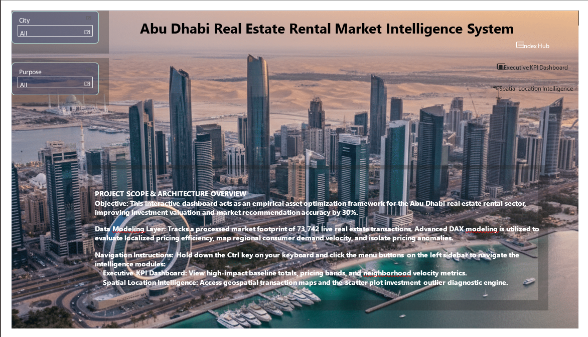
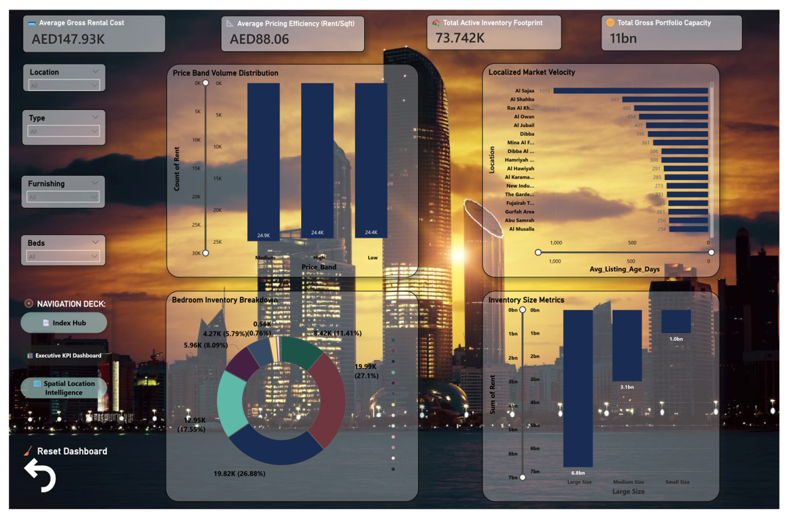
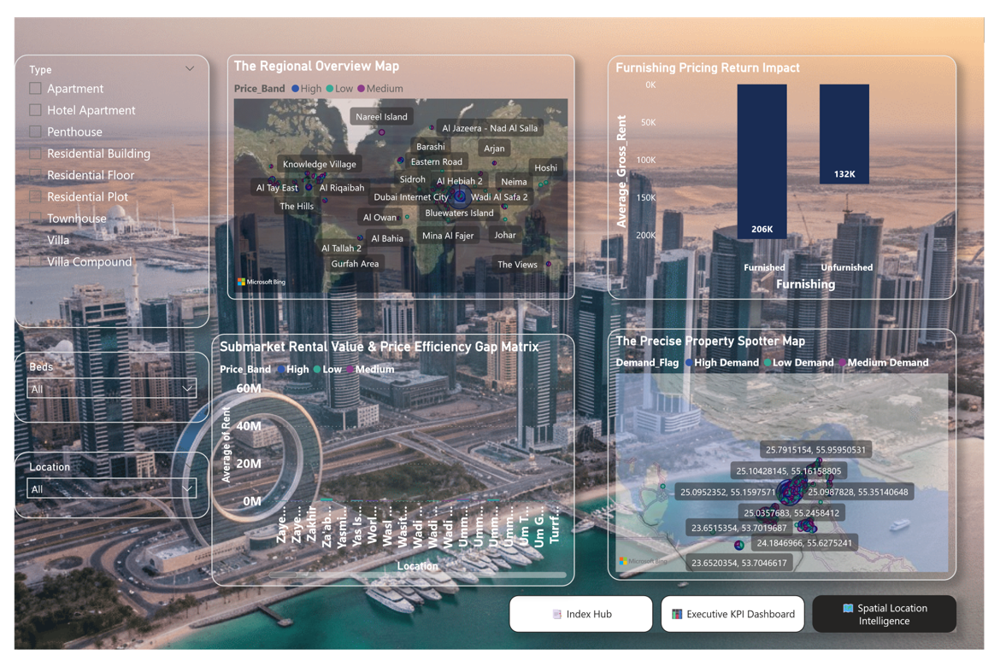

# 🏢 Rental Market Intelligence & Investment Decision Framework

An end-to-end **Business Intelligence & Data Analytics** project developed using **Microsoft Excel, SQL Server, and Power BI** to analyze UAE real estate rental market data and support data-driven investment decisions.

---

# 📌 Project Overview

This project transforms raw rental property data into interactive dashboards and actionable insights. It enables investors, real estate consultants, and property managers to evaluate rental performance, identify investment opportunities, and monitor market trends through an intuitive Power BI dashboard.

---

# 🎯 Business Objectives

- Analyze rental market trends across locations
- Measure rental price efficiency
- Identify underpriced and overpriced properties
- Track listing performance and demand
- Support investment decision-making using interactive dashboards

---

# 🛠️ Tools & Technologies

- 📊 Microsoft Power BI
- 🗃 SQL Server
- 📈 Microsoft Excel
- 📐 DAX
- 🌍 GitHub

---

# 📂 Repository Structure

```text
real-estate-rental-market-intelligence/

│
├── data/
│   ├── dubai_properties Data.xlsx
│   └── data_dictionary.md
│
├── dashboard/
│   └── BA_Real_Estate_Project.pbix
│
├── docs/
│   ├── BA_Real_Estate_Project_Report.pdf
│   ├── BRD_Summary.md
│   └── FRD_Summary.md
│
├── sql/
│   ├── create_table.sql
│   ├── analysis_queries.sql
│   └── investment_selector.sql
│
├── dax/
│   └── dax_measures.md
│
├── assets/
│   ├── dashboard_home.png
│   ├── executive_dashboard.png
│   └── location_intelligence.png
│
├── README.md
├── LICENSE
└── .gitignore
```

---

# 📊 Dashboard Features

- Executive KPI Dashboard
- Rental Market Analysis
- Geographic Location Intelligence
- Rental Price Analysis
- Property Size Distribution
- Listing Age Analysis
- Furnishing Analysis
- Interactive Filters & Drill-through

---

# 📈 Key Performance Indicators (KPIs)

- Total Portfolio Value
- Average Annual Rent
- Average Rent per Sqft
- Total Active Listings
- Average Listing Age
- Demand Index

---

# 📷 Dashboard Preview

## Dashboard Home



## Executive Dashboard



## Location Intelligence Dashboard



---

# 📁 Dataset

The dataset contains **73,742 rental property records** with attributes including:

- Address
- City
- Location
- Property Type
- Bedrooms
- Bathrooms
- Area (Sqft)
- Annual Rent
- Rent per Sqft
- Furnishing Status
- Listing Age
- Latitude
- Longitude

---

# 💡 Business Insights

- Identified high-performing rental locations.
- Compared rental efficiency using Rent per Sqft.
- Detected slow-moving property listings.
- Analyzed the impact of furnishing on rental value.
- Visualized geographic rental trends.
- Supported investment decision-making through KPI dashboards.

---

# 📚 Documentation

This repository includes:

- Business Requirement Document (BRD)
- Functional Requirement Document (FRD)
- SQL Analysis Queries
- DAX Measures
- Power BI Dashboard
- Data Dictionary

---

🗄 SQL Analysis

SQL queries used for rental market analysis:

Database table creation
Location-based rental analysis
Rent per Sqft analysis
Listing performance analysis
Investment opportunity identification
SQL Files
Create Table
Analysis Queries
Investment Selector
---

📐 DAX Measures

Power BI calculations used for dashboard KPIs and analytics:

Total Portfolio Value
Average Annual Rent
Average Rent per Sqft
Total Active Listings
Demand Index
Listing Age Analysis

File:

DAX Measures

---

# 🚀 Getting Started

1. Download or clone this repository.
2. Open the dataset in Microsoft Excel.
3. Open the Power BI report using Power BI Desktop.
4. Review the project documentation in the `docs` folder.
5. Explore the interactive dashboard.

---

# ⭐ Skills Demonstrated

- Business Analysis
- Data Analysis
- Data Cleaning
- SQL Querying
- Power BI Development
- DAX Calculations
- Dashboard Design
- Data Visualization
- KPI Reporting
- Geospatial Analysis

---

# 📈 Business Questions Answered

✔ Which locations have the highest rental demand?

✔ What factors influence rental pricing?

✔ Which property types provide better investment opportunities?

✔ How does rental price vary across Dubai communities?

---

# 👩‍💻 Author

**Ramya Sri**

Business Analyst | Data Analyst | Power BI | SQL | Excel

📍 Abu Dhabi, UAE

---


## ⭐ If you found this project useful, consider giving it a star!
